# 🌙 MoonBeats

A Spotify/Lofi mix inspired music app. Browse chart tracks, search artists and albums, build playlists, and like songs all powered by the Deezer API and secured with Auth0.

---

## Live demo

> 🚀 Coming soon - will be deployed to Vercel once `dev` is merged into `main`.

<!-- Once live, replace the line above with:
**[moonbeats.vercel.app](https://moonbeats.vercel.app)**
-->

---

## Screenshots

### Desktop

**Landing**
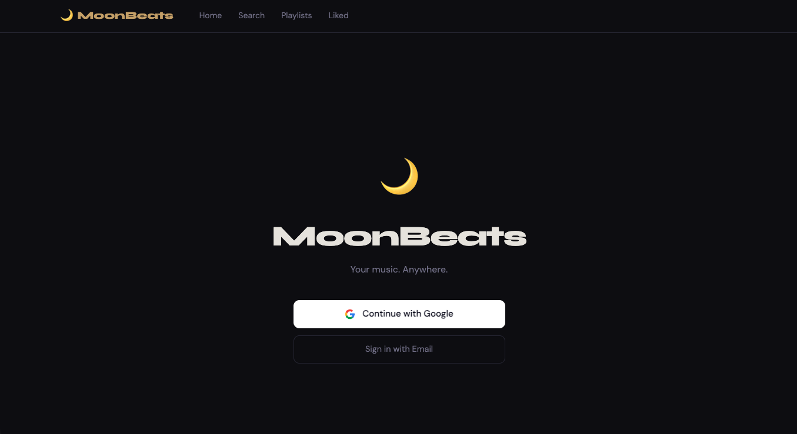

**Home**
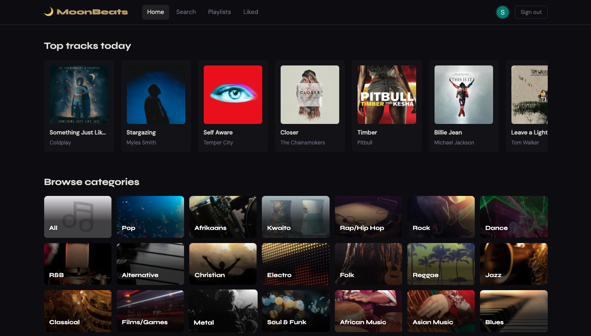

**Search**
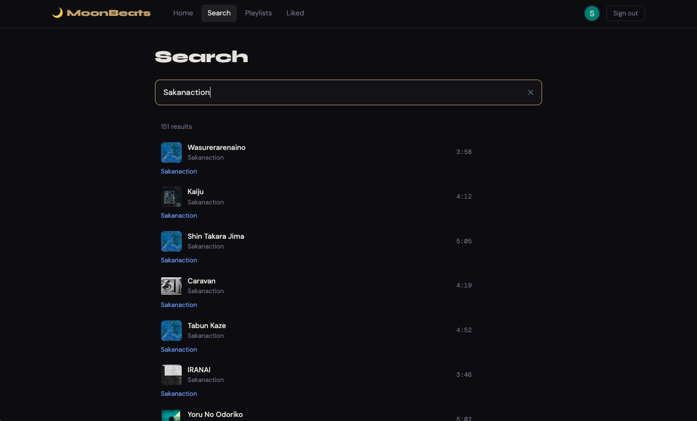

**Playlist**
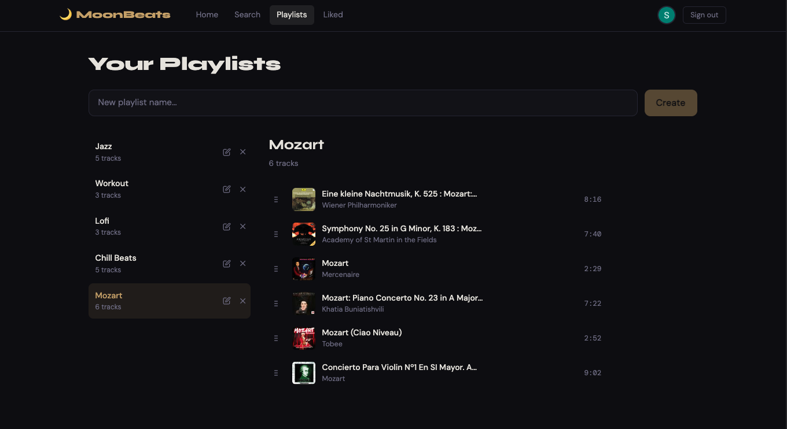

**Album**
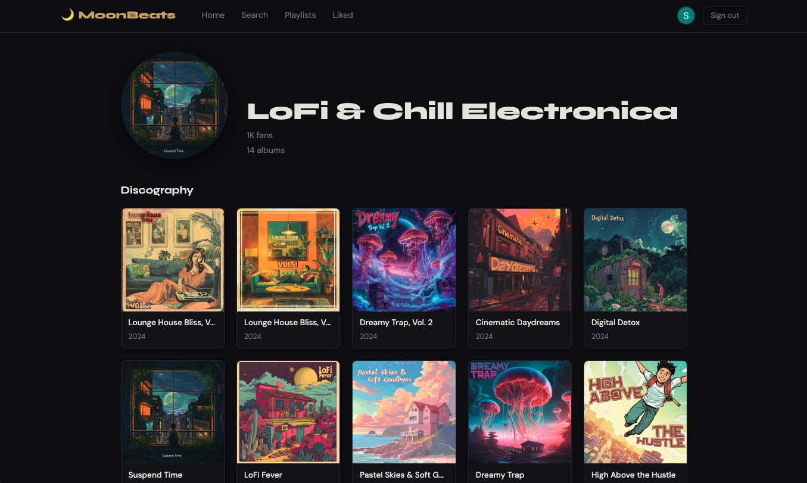

**Liked Songs**
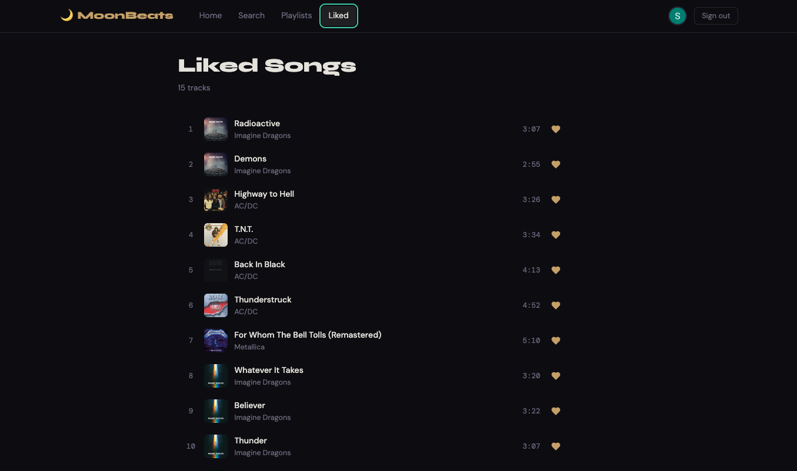

### Mobile

**Landing**
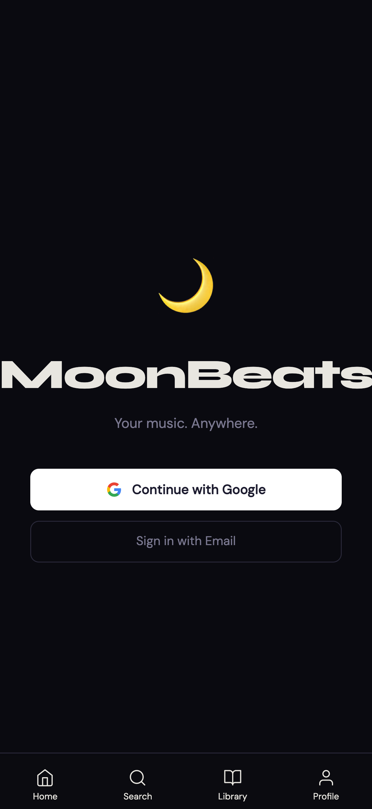

**Home**
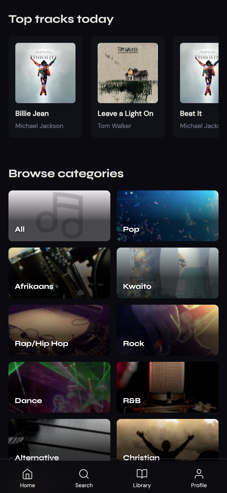

**Search**
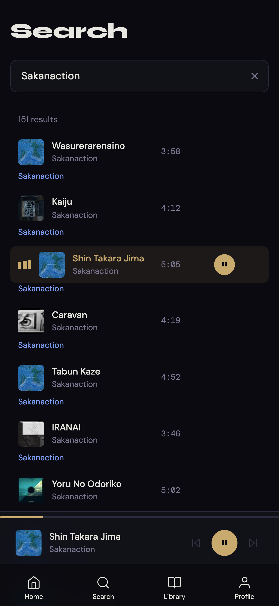

**Album**
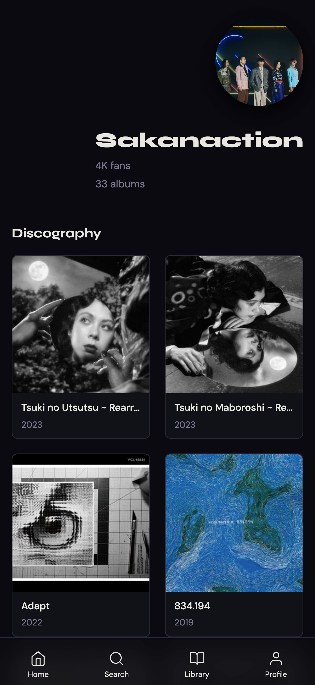

**Playlist**
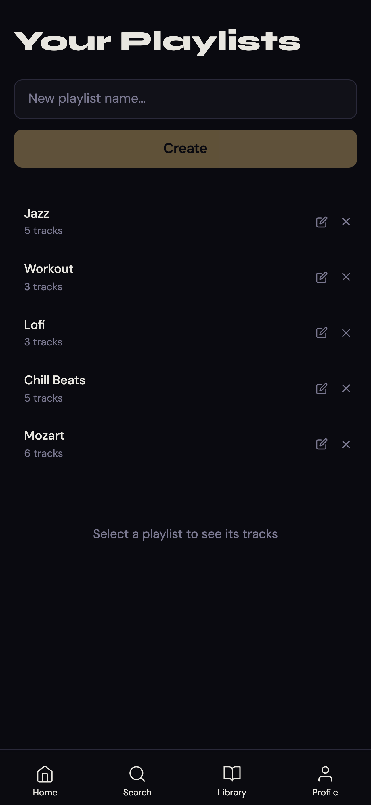


**Profile**
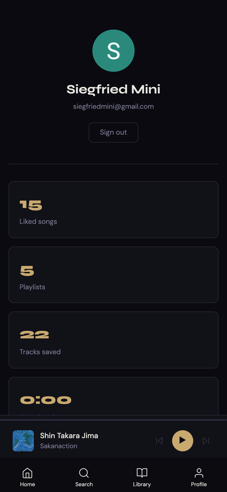

### Lighthouse

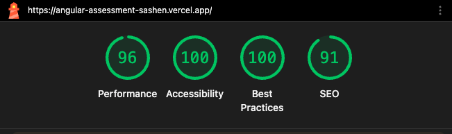

---

## Features

- **Home** - Chart tracks shelf, recently played, and genre browser with cover art
- **Search** - Live debounced search for tracks, artists, and albums; click a genre to load its chart
- **Artist & Album pages** - Full discography and track listings
- **Playlists** - Create, rename, delete, drag-to-reorder, and remove individual tracks
- **Liked Songs** - Heart any track to save it; persisted in IndexedDB
- **Player bar** - 30-second Deezer previews with seek, volume, prev/next queue navigation
- **Auth** - Google login (and email/password) via Auth0, profile page shows real avatar
- **Mobile** - Bottom navigation bar, responsive layouts, navbar hidden on small screens

---

## Tech stack

- **Angular 21** - standalone APIs, no NgModules
- **TypeScript** - strict mode + `noUncheckedIndexedAccess`, zero `any` usage
- **Angular Signals** + `toSignal()` for RxJS interop
- **Dexie.js** - IndexedDB wrapper for playlists and liked songs
- **Auth0** - Google login via `@auth0/auth0-angular`
- **Deezer API** - public API via CORS proxy
- **@angular/cdk** - drag-and-drop reordering
- **SCSS** - no utility framework
- **Vercel** - deployment

### State management - why Signals over NgRx

**Signals** (`signal()`, `computed()`, `effect()`) were chosen as the state management approach instead of NgRx.

The app's state i implemented since i have a list of playlists, liked songs, and search results. NgRx would have required actions, reducers, selectors, and effects for every one of those a large amount of boilerplate for state would be needed. Signals let each store be a plain Injectable service that owns its own state, is easy to read.

**Advantages of Signals**
- No boilerplate - no actions, reducers, or selectors to wire up
- State lives close to where it is used; each store is a single readable file
- computed replaces selectors with zero setup
- effect handles side effects (syncing audio element, persisting to IndexedDB) declaratively

**Disadvantages**
- No built in devtools for time-travel debugging
- No enforced unidirectional data flow
- RxJS still needed at the boundary where third-party libraries emit observables (Auth0 uses isAuthenticated$, user$), toSignal was used to bridge those into the signal graph without spreading RxJS further into the app

**Why RxJS was not removed entirely**
Auth0's Angular SDK exposes its state as RxJS observables. Rather than rewriting that integration, `toSignal()` was used at the `AuthService` boundary to convert those streams into signals once, keeping the rest of the app fully signal-based.

---

## Dependencies

The packages below were installed on top of the default `ng new` scaffold. Run `npm install` to get everything - the full list is in `package.json`.

### Runtime

| Package | Version | Purpose |
|---|---|---|
| `@angular/cdk` | 21.2.10 | Drag-and-drop (DragDropModule) |
| `@auth0/auth0-angular` | 2.9.0 | Auth0 Google / email login |
| `dexie` | 4.4.2 | IndexedDB wrapper (playlists, liked songs) |

### Dev

| Package | Version | Purpose |
|---|---|---|
| `prettier` | 3.8.1 | Code formatter |
| `vitest` | 4.0.8 | Unit test runner |
| `postcss` | 8.5.13 | CSS processing |
| `autoprefixer` | 10.5.0 | CSS vendor prefixes |

---

## Getting started

### 1. Install dependencies

```bash
npm install
```

### 2. Configure environment

Create `src/environments/environment.ts` (gitignored):

```ts
export const environment = {
  production: false,
  deezerApiBaseUrl: '/api/deezer',
  auth0Domain:   'YOUR_TENANT.us.auth0.com',
  auth0ClientId: 'YOUR_CLIENT_ID',
} as const;

Object.freeze(environment);
```

Create `src/environments/environment.production.ts` with the same shape, using production credentials.

> Get Auth0 credentials from [auth0.com](https://auth0.com) - create a **Single Page Application**, set callback/logout/origin URLs to `http://localhost:4200`.

### 3. Start the dev server

```bash
ng serve
```

Open [http://localhost:4200](http://localhost:4200).

---

## Scripts

| Command | Description |
|---|---|
| `ng serve` | Dev server |
| `ng build` | Production build  |
| `ng lint` | ESLint across all TS and HTML |
| `npx tsc -p tsconfig.app.json --noEmit` | Full type-check without building |

---

## Project structure

```
src/
├── app/
│   ├── core/
│   │   ├── database/        
│   │   ├── interceptors/    
│   │   ├── services/        
│   │   ├── strategies/      
│   │   └── tokens/          
│   ├── features/
│   │   ├── album/           
│   │   ├── artist/          
│   │   ├── home/            
│   │   ├── landing/         
│   │   ├── liked/           
│   │   ├── playlist/        
│   │   ├── profile/         
│   │   └── search/          
│   ├── guards/              
│   ├── models/              
│   ├── routes/              
│   ├── shared/
│   │   ├── components/
│   │   │   ├── bottom-nav/  
│   │   │   ├── navbar/      
│   │   │   ├── player-bar/  
│   │   │   ├── sidebar/     
│   │   │   └── track-card/  
│   │   ├── directives/
│   │   └── pipes/           
│   └── store/
│       ├── liked.store.ts   
│       ├── player.store.ts  
│       ├── playlist.store.tsplaylists 
│       ├── recently-played.store.ts 
│       └── search.store.ts          
└── environments/
    ├── environment.ts              
    └── environment.production.ts   
```

---

## Branch strategy

| Branch | Purpose |
|---|---|
| `main` | Production releases only |
| `dev` | Integration - all features land here first |
| `feature/*` | One branch per phase, PR into `dev` |

### Phases shipped

| Phase | Branch | Description |
|---|---|---|
| 1 | `feature/foundation` | Angular scaffold, routing, proxy |
| 2 | `feature/auth-stub` | Auth stub, guard, landing page |
| 3–6 | `feature/layout` / `feature/api` / `feature/state` / `feature/polish` | Layout, Deezer API, Signal stores, UI polish |
| 7 | `feature/quality` | Strict TypeScript, ESLint, pipes |
| 8 | `feature/enhanced-ux` | Home, Liked, Playlists, Player queue, bottom nav |
| 9 | `feature/auth0-login` | Auth0 Google login, real user profile |

---

## Deployment

### Vercel (coming soon)

Once `dev` is merged into `main`, the app will be deployed to Vercel.

<!-- Once deployed, document the steps taken here:
1. Import the GitHub repo into Vercel
2. Set build command: `ng build`
3. Set output directory: `dist/angular-assessment-sashen/browser`
4. Add environment variables in Vercel dashboard:
   - AUTH0_DOMAIN
   - AUTH0_CLIENT_ID
5. Add the Vercel URL to Auth0 → Application Settings → Allowed Callback/Logout/Web Origins URLs
-->

---

## Auth0 setup (quick reference)

1. Create a **Single Page Application** at [auth0.com](https://auth0.com)
2. Set all three URL fields to `http://localhost:4200` (add Vercel URL when deploying)
3. Enable **Google social connection** under Authentication → Social
4. Copy **Domain** and **Client ID** into your environment files

---

## Data persistence

| Data | Storage | Tied to account? |
|---|---|---|
| Playlists | IndexedDB (Dexie) | Device only |
| Liked songs | IndexedDB (Dexie) | Device only |
| Recently played | localStorage | Device only |
| Auth session | Auth0 / browser cookie | Yes - Auth0 account |

---

## Possible improvements 'Food for Thought'

- **Synth Wave Graph** - This would be a feature that is more of a visual representation of the music played, moving according to it's rhythm.
- - **Lyrics/Video** - This would be a feature that is more of a visual representation again but could also affect our performance and is currently not done with the Deezer API. Most likely will need to research how we would integrate and affect our performance.
- **Logging** - Would be great to add some logging that will let us know where certain things might be an issue but allso allow the user to continue using the app.
- **Cloud sync** - move playlists and liked songs from IndexedDB to a backend (e.g. Supabase or Firebase) so they follow the user across devices.
- **PWA / offline mode** - add a service worker so the app shell and cached tracks load without a network connection. This would be cool to add but could be a topic that need to be researched heavily when we do it.

---

## References

Technologies and specific patterns used while building this project.

**Frameworks & language**
- [Angular docs](https://angular.dev) - top-level reference
- [Angular standalone components](https://angular.dev/guide/components/importing) - no NgModules pattern used throughout
- [Angular Signals](https://angular.dev/guide/signals) - `signal()`, `computed()`, `effect()` used in every store
- [Angular `toSignal()`](https://angular.dev/guide/rxjs-interop) - bridges RxJS observables (Auth0) into signals
- [Angular new control flow](https://angular.dev/guide/templates/control-flow) - `@if`, `@for`, `@let` used in all templates
- [TypeScript `noUncheckedIndexedAccess`](https://www.typescriptlang.org/tsconfig/#noUncheckedIndexedAccess) - strict array/string indexing enabled in tsconfig

**State & storage**
- [Angular `effect()`](https://angular.dev/api/core/effect) - used in LandingComponent to redirect after Auth0 callback
- [Dexie.js getting started](https://dexie.org/docs/Tutorial/Getting-started) - IndexedDB schema and CRUD for playlists and liked songs
- [Dexie `liveQuery`](https://dexie.org/docs/liveQuery()) - reactive queries wired to signals in stores

**Auth**
- [Auth0 Angular quickstart](https://auth0.com/docs/quickstart/spa/angular) - `provideAuth0`, login, logout flow
- [Auth0 Angular SDK - GitHub](https://github.com/auth0/auth0-angular) - `isLoading$`, `isAuthenticated$`, `user$` observables

**API & UI**
- [Deezer API reference](https://developers.deezer.com/api) - chart tracks, search, album, artist endpoints
- [Angular CDK drag-and-drop](https://material.angular.io/cdk/drag-drop/overview) - playlist track reordering
- [MDN - CSS custom properties](https://developer.mozilla.org/en-US/docs/Web/CSS/Using_CSS_custom_properties) - `--pct` variable used for seek bar gold fill
- [MDN - CSS range input styling](https://developer.mozilla.org/en-US/docs/Web/CSS/CSS_nesting) - webkit/moz track gradient on the player seek bar

**Deployment**
- [Vercel docs](https://vercel.com/docs) - deployment platform
- [Auth0 - set allowed URLs](https://auth0.com/docs/get-started/applications/application-settings) - callback, logout, and web origin URL config
